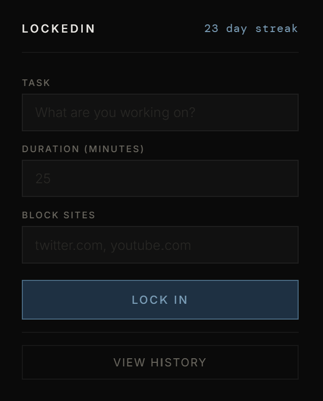
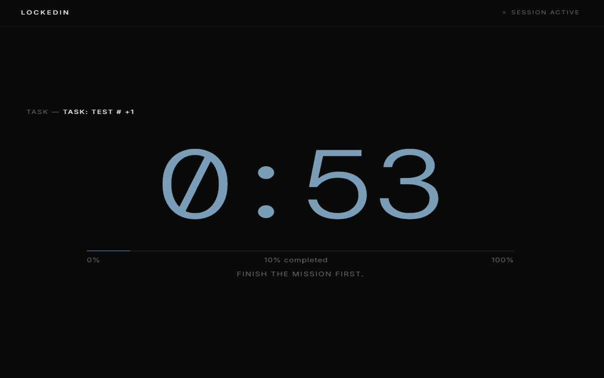
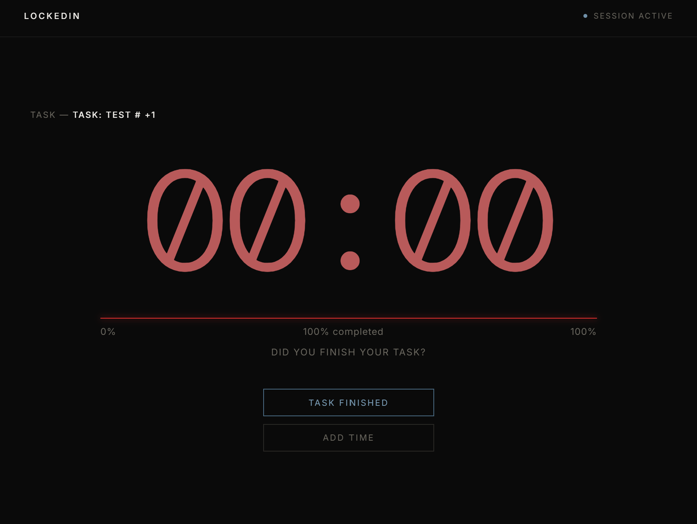
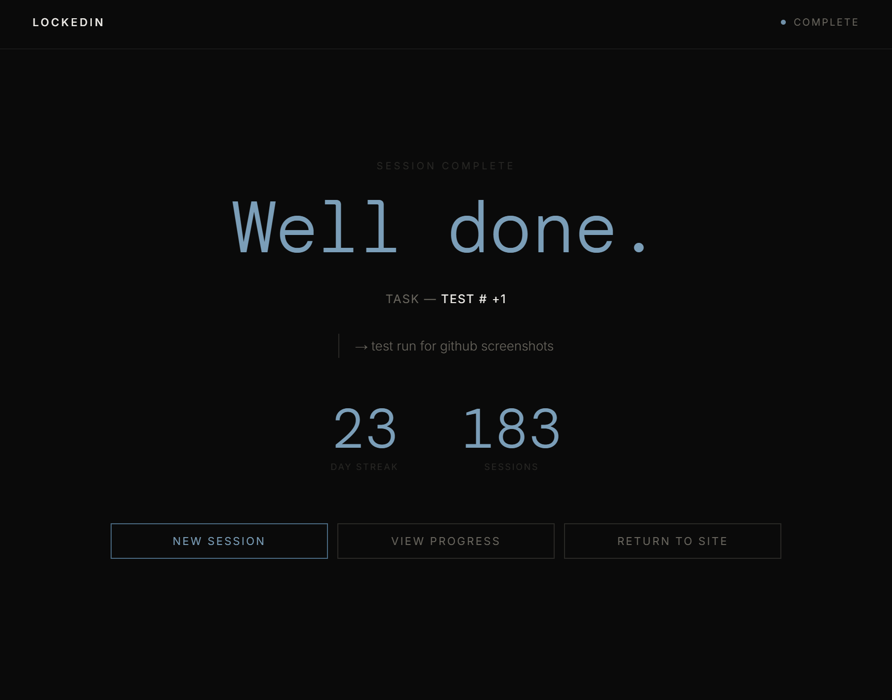
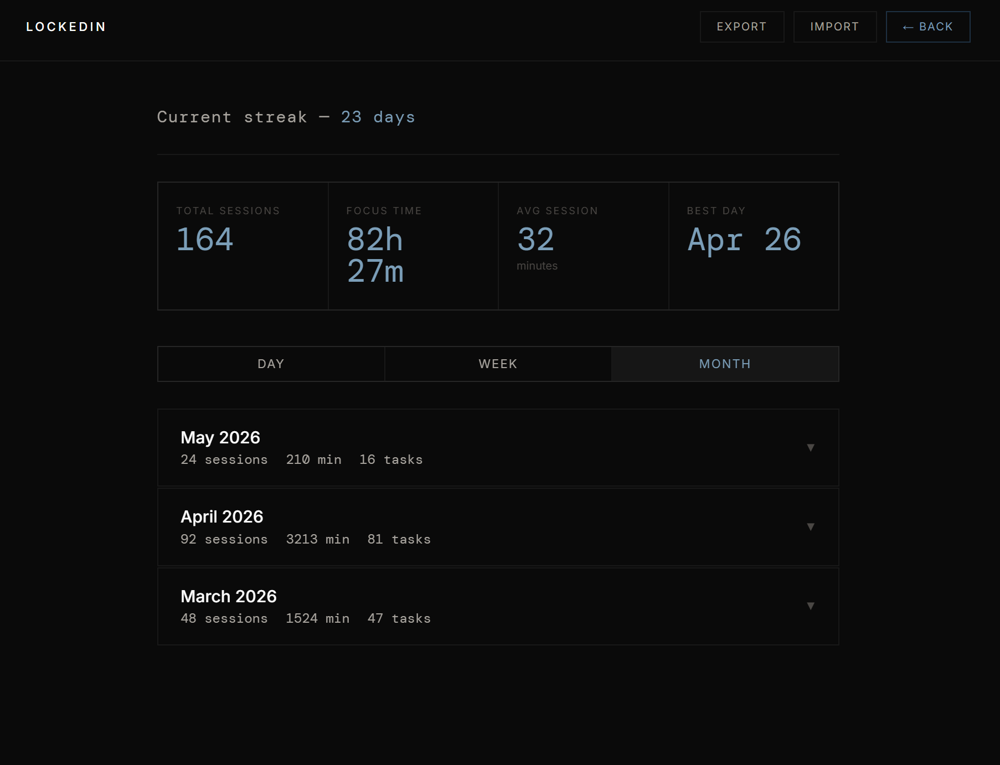

# LockedIn
A Chrome extension for distraction-free focus sessions, streak tracking, and accountability-driven productivity. 
> Built and used daily — 55+ day streak logged
**Now live on the Chrome Web Store:**
[Install LockedIn](https://chromewebstore.google.com/detail/lockedin/logjclckgphbodlapdiffnkjbbdgfeaa)

## Screenshots
<table>
  <tr>
    <td></td>
    <td></td>
  </tr>
  <tr>
    <td align="center">Popup</td>
    <td align="center">Focus Mode</td>
  </tr>
  <tr>
    <td></td>
    <td></td>
  </tr>
  <tr>
    <td align="center">Session Complete</td>
    <td align="center">Mission Complete</td>
  </tr>
</table>

## What It Does
LockedIn helps users stay focused and build consistent work habits through structured sessions, progress tracking, and reflection. Unlike passive timers, LockedIn requires you to define a specifc task before starting a session, encouraging clarity and goal-oriented work. 

## Features
- <b>Intentional Task Setting (Pre-Commitment)</b>
    Users must define a specific task before starting a focus session
- <b>Website Blocking</b>
    Blocks distracting sites while a session is active
- <b>Saved Blocklist with Quick-Select Chips</b>
    Save frequently blocked sites once — click chips to toggle on/off per session. Persisted via chrome.storage.sync across devices.
- <b>Pause/Resume Timer</b>
    Pause mid-session if interrupted — timer freezes, sites stay blocked, clock resumes exactly where it stopped.
- <b>Custom Focus Timer</b>
    Start timed sessions with a live progress bar and countdown
- <b>Session Reflection (Post-Session Logging)</b>
    Users are required to write what they accomplished before completing a session, reinforcing accountability.
- <b>Stats Dashboard</b>
    View total sessions, total focus time, average session length and best day
- <b>Streak Tracking</b>
    Track consecutive days of productivity
- <b>Session History</b>
    View past sessions grouped dynamically by day, week or month
- <b>Import/Export Data</b>
    Backup and restore session history locally

## Motivation
As a student balancing intensive academic work and personal projects, I often struggled with staying focused despite using traditional productivity tools. Many tools either focused solely on blocking distractions or tracking time, but didn't address the full workflow of intentional work. 

I built LockedIn to solve this problem by creating a system that encourages:
- Setting a clear task before starting
- Eliminating distractions during work
- Reflecting on what was accomplished afterward

By combining these elements,  transforms productivity from simply "spending time" into actively making progress. This project reflects my interest in building tools that are not only functional, but also aligned with how people actually work and stay accountable. 

Available on the [Chrome Web Store](https://chromewebstore.google.com/detail/lockedin/logjclckgphbodlapdiffnkjbbdgfeaa).

To load manually from source:
  1. Clone or download this repository
  2. Open Chrome and go to `chrome://extensions`
  3. Enable **Developer mode** (top right toggle)
  4. Click **Load unpacked**
  5. Select the project folder
 
## Usage
  1. Click the LockedIn icon in your Chrome toolbar
  2. Enter your task and focus duration
  3. Select sites to block — click saved chips or type a new one
  4. Click **Lock In** to begin
  5. If interrupted, hit **Pause** — sites stay blocked, timer freezes
  6. Hit **Resume** when you're back
  7. When timer ends, choose **Task Finished** or **Add Time**
  8. Write your reflection (required)
  9. View progress in **History**

## Tech Stack
- JavaScript (Vanilla)
- Chrome Extensions API
- HTML/CSS
- Local Storage (chrome.storage.local)
- chrome.storage.sync (saved blocklist - persists across devices)

---
✨ Built as a portfolio project focused on intentional work, accountability, and real-world usability
